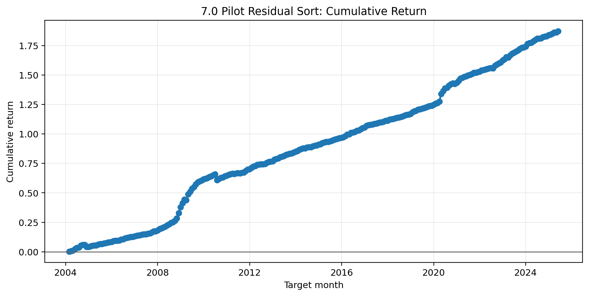
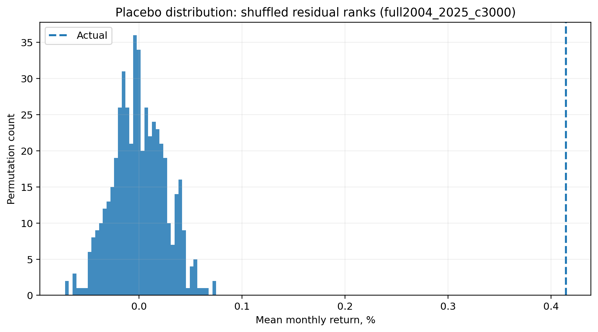
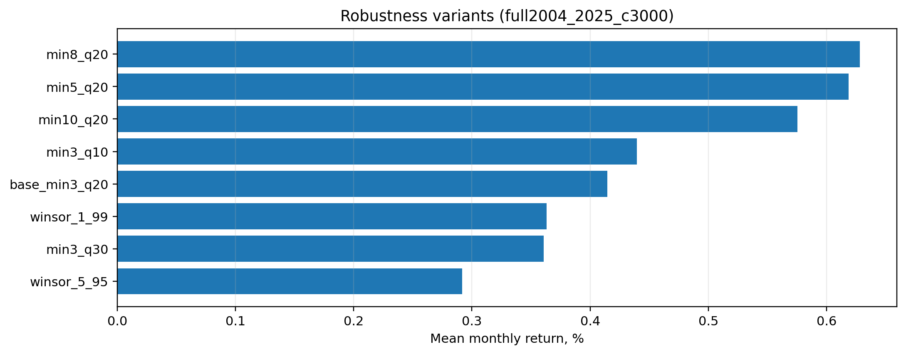
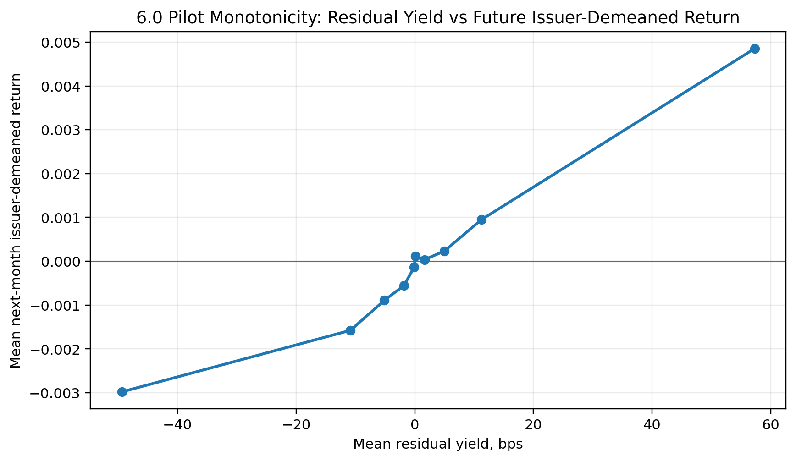
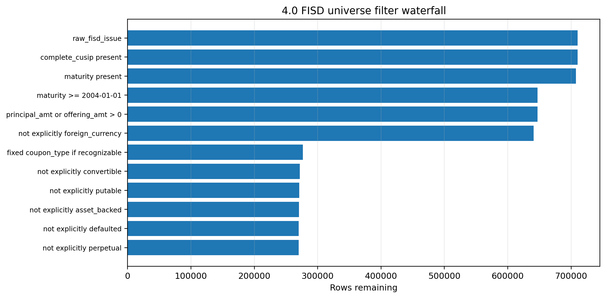

# Transaction-Based Issuer Yield Curve Relative Value in U.S. Corporate Bonds

This repository builds a transaction-based fixed-income relative-value research pipeline for U.S. corporate bonds.

The core idea is simple: within the same issuer, bonds that trade cheap relative to an issuer-specific TRACE-implied yield curve should subsequently outperform bonds that trade rich.

## Headline result

Sample tag: `full2004_2025_c3000`

| Metric | Value |
|---|---:|
| Panel rows | 2,200,771 |
| Issuer-demeaned target rows | 1,459,247 |
| Monthly observations | 256 |
| Issuer-month groups | 182,763 |
| Position rows | 555,416 |
| Mean monthly return | 0.414% |
| Annualized Sharpe | 2.53 |
| t-stat | 11.69 |
| Cumulative return | 187.1% |
| Max drawdown | -2.95% |
| Look-ahead violations | 0 |
| Duplicate CUSIP-feature-month rows | 0 |
| Placebo p-value | 0.001996 |

## Key figures

### Cumulative residual-sort performance

### Placebo validation

### Robustness variants

### Signal monotonicity

### FISD universe construction

## Research question

When two bonds belong to the same issuer, does the bond that trades cheap relative to the issuer's transaction-implied yield curve subsequently outperform the issuer's other bonds?

## Method

1. Build a conservative FISD universe of U.S.-dollar, fixed-coupon, non-convertible, non-putable, non-ABS corporate bonds.
2. Aggregate TRACE Enhanced transactions to a bond-day panel.
3. Fit weekly issuer Nelson-Siegel yield curves.
4. Compute residual yield: observed TRACE yield minus fitted issuer-curve yield.
5. Collapse weekly residuals into monthly issuer-relative signals.
6. Construct next-month issuer-demeaned bond returns from WRDS Bond Returns.
7. Run a same-issuer long-cheap / short-rich residual-sort baseline.
8. Validate with no-look-ahead checks, robustness variants, winsorization, and placebo permutations.

## Main outputs

``text
reports/final_results_full2004_2025_c3000.md
reports/tables/headline_results_full2004_2025_c3000.csv
reports/tables/monthly_strategy_returns_full2004_2025_c3000.csv
reports/tables/robustness_variants_full2004_2025_c3000.csv
artifacts/discovery/7.1_validation_report_full2004_2025_c3000.md
``

## Data safety and reproducibility

Raw and derived WRDS data are not redistributed.

This repository contains code, configurations, aggregate reports, validation summaries, and figures. Reproducing the full result requires WRDS access to TRACE Enhanced, FISD, and WRDS Bond Returns.

Do not commit:

``text
artifacts/raw/
artifacts/interim/
artifacts/processed/
*.parquet
logs/
*.tar.gz
.pgpass
*.pem
*.key
``
